<!-- TOC -->

- [Networks](#networks)
    - [Deep Generative Image Models using a Laplacian Pyramid of Adversarial Networks](#deep-generative-image-models-using-a-laplacian-pyramid-of-adversarial-networks)
        - [Main idea](#main-idea)
        - [Laplacian Pyramid](#laplacian-pyramid)
        - [LAPGAN](#lapgan)
        - [Thinking](#thinking)
    - [Unsupervised Representation Learning with Deep Convolutional Generative Adversarial](#unsupervised-representation-learning-with-deep-convolutional-generative-adversarial)
        - [Main idea](#main-idea)
        - [Architecture](#architecture)
        - [Experiments](#experiments)
    - [Improved Techniques for Training GANs](#improved-techniques-for-training-gans)
        - [Main idea](#main-idea)
        - [Feature Matching](#feature-matching)
        - [Minibatch Discrimination](#minibatch-discrimination)
        - [Historical averaging](#historical-averaging)
        - [One-sided label smoothing](#one-sided-label-smoothing)
        - [Virtual batch normalization](#virtual-batch-normalization)
        - [Assessment of image quality](#assessment-of-image-quality)
        - [Semi-supervised learning](#semi-supervised-learning)
    - [Generative Image Modeling using Style and Structure Adversarial Networks](#generative-image-modeling-using-style-and-structure-adversarial-networks)
        - [Main idea](#main-idea)
        - [Structure-GAN](#structure-gan)
        - [Style-GAN](#style-gan)
        - [Style-GAN with Pixel-wise Constraints](#style-gan-with-pixel-wise-constraints)
        - [Joint Learning for S2-GAN](#joint-learning-for-s2-gan)
        - [Experiments](#experiments)
    - [Learning from Simulated and Unsupervised Images through Adversarial Training](#learning-from-simulated-and-unsupervised-images-through-adversarial-training)
        - [Main idea](#main-idea)
        - [Architecture](#architecture)
        - [Adversarial Loss with Self-Regularization](#adversarial-loss-with-self-regularization)
        - [Local adversarial loss](#local-adversarial-loss)
        - [perceptual loss](#perceptual-loss)
        - [Loss function](#loss-function)
    - [Face Synthesis from Visual Attributes via Sketch using Conditional VAEs and GANs](#face-synthesis-from-visual-attributes-via-sketch-using-conditional-vaes-and-gans)
        - [Main idea](#main-idea)
        - [Motivation](#motivation)
        - [Architecture](#architecture)
        - [Stage 1: Attribute-to-Sketch](#stage-1-attribute-to-sketch)
        - [Stage 2: Sketch-to-Sketch (S2S)](#stage-2-sketch-to-sketch-s2s)
        - [Stage 3: Sketch-to-Face (S2F)](#stage-3-sketch-to-face-s2f)
    - [Experiments](#experiments)

<!-- /TOC -->

# Networks
## Deep Generative Image Models using a Laplacian Pyramid of Adversarial Networks

### Main idea
The authors introduce a generative parametric model capable of producing high quality samples of natural images, using a cascade of convolutional networks within Laplacian pyramid framework(LPGAN) to generate images in a coarse-to-fine fashion.

### Laplacian Pyramid
The Laplacian pyramid is a linear invertible image representation consisting of a set of band-pass images, spaced an octave apart, plus a low-frequency residual. I(0) = I and I(k) is k repeated applications of downsampling.

Starting at the coarsest level, we repeatedly upsample and add the difference image h at the next finer level until we get back to the full resolution image.

### LAPGAN
In the reconstruction procedure, a set of conditional generative convet models {G0,…,Gk}, each of which captures the distribution of coefficients h_k for natural images at a different level of the Laplacian pyramid.

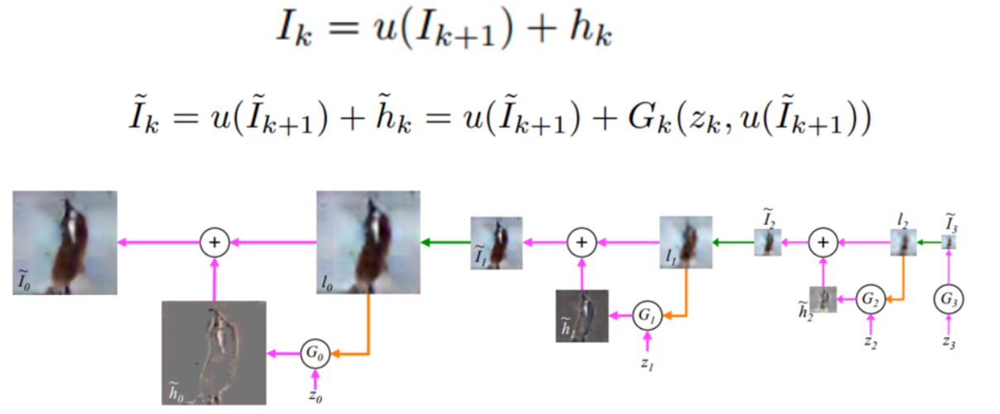

In the training procedure, G(k) is a convnet which uses a coarse scale version of the image l(k) = u(I(k+1)) as an input, as well as noise vector z(k). D(k) takes as input h(k) or h’(k), along with the low-pass image l(k), and predicts if the image was real or generated. 

### Thinking
(1) Breaking the generation into successive refinements is the key idea in this work.
(2) The authors never make any attempt to train a network to discriminate between the output of a cascade and a real image and instead focus on making each step plausible.
(3) The independent training of each pyramid level has the advantage that it is far more difficult for the model to memorize training examples – a hazard when high capacity deep networks are used.

## Unsupervised Representation Learning with Deep Convolutional Generative Adversarial

### Main idea
(1) The authors propose and evaluate a set of constraints on the architectural topology of convolutional GANs, named DCGAN, making them stable to train in most datasets.
(2) The authors visualize the filters learnt by GANs and empirically show that specific filters have learned to draw specific obejects.
(3) The authors show that the generators have interesting vector arithmetic properties allowing for easy manipulation of many semantic qualities of generated samples.

### Architecture
1. All convolutional net replaces deterministic spatial pooling functions (such as maxpooling).
Discriminator: strided convolutions
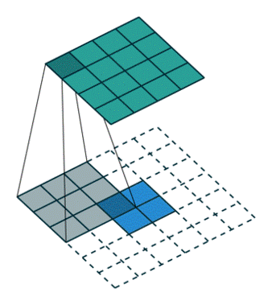
Generator: fractional strided convolutions

2. Remove fully connected hidden layers for deeper architectures.

3. Use batchnorm in both the generator and the discriminator, which helps deal with training problems that arise due to poor initialization and helps gradient flow in deeper models

4. Use ReLU activation in generator for all layers except for the output which uses Tanh and Use LeakyReLU activation in the discriminator for all layers

### Experiments
(1) Validation of DCGAN capabilities using GANs as a feature extractor

(2) Walking in the latent space(z) results in semantic changes

(3) Using guided backpropagation to visualize the features learnt by discriminator

(4) Remove certain objects by dropping out relevant feature activations

(5) Perform vector arithmetic on the Z vectors to evaluate learned representation space

## Improved Techniques for Training GANs
### Main idea
The authors present a variety of new architectural features and training procedures for GANs framework, which help greatly in semi-supervised classification and the generation of images that humans find visually realistic. 

### Feature Matching
Instead of directly maximizing the output of the discriminator, the new objective requires the generator to generate data that matches the statistics of the real data, where we use the discriminator only to specify the statistics that we think are worth matching. Specifically, we train the generator to match the expected value of the features on an intermediate layer of the discriminator. 

### Minibatch Discrimination
Discriminator model that looks at multiple examples in combination, rather than in isolation, could potentially help avoid collapse of the generator. Modelling the closeness between examples in a minibatch is as follows:

### Historical averaging
modify each player’s cost to include a term:

where θ[i] is the value of the parameters at past time i. This approach was able to find equilibria of low-dimensional, continuous non-convex games and some specific cases.

### One-sided label smoothing
Replacing the 0 and 1 targets for a classifier with smoothed values, like 0.9 or 0.1, is shown to reduce the vulnerability of neural networks to adversarial examples. Replacing positive classification targets with α and negative targets with β:

smooth only the positive labels to α, leaving negative labels set to 0. 

### Virtual batch normalization
(1) Batch normalization causes the output of a neural network for an input example x to be highly dependent on several other inputs x’ in the same minibatch. 

(2) To avoid this problem we introduce virtual batch normalization (VBN), in which each example x is normalized based on the statistics collected on a reference batch of examples that are chosen once and fixed at the start of training, and on x itself. 

### Assessment of image quality
1. One intuitive metric of performance can be obtained by having human annotators judge the visual quality of samples, but the metric varies depending on the setup of the task and the motivation of the annotators

2. An automatic method to evaluate samples: images that contain meaningful objects should have a conditional label distribution p(y|x) with low entropy. Moreover, we expect the model to generate varied images, so the marginal ∫ p(y|x = G(z)) 𝑑𝑧  should have high entropy.

### Semi-supervised learning
We can do semi-supervised learning with any standard classifier by simply adding samples from the GAN generator G to our data set, labeling them with a new “generated” class y = K + 1.

## Generative Image Modeling using Style and Structure Adversarial Networks
### Main idea
The authors factorize the image generation process and propose Style and Structure Generative Adversarial Network (S2-GAN) consisting of two components: 
- the Structure-GAN generates a surface normal map; 
- the Style-GAN takes the surface normal map as input and generates the 2D image. 

### Structure-GAN
We train a Structure-GAN using the ground truth surface normal from Kinect. Because the perspective distortion of texture is more directly related to normals than to depth, we use surface normal to represent image structure in this paper. 

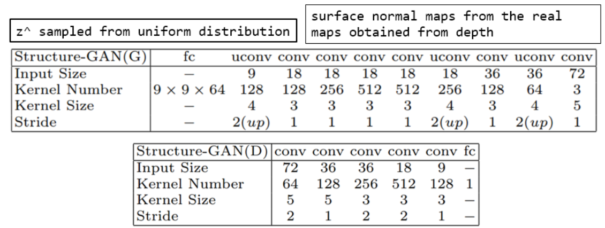

### Style-GAN
Given the RGB images and surface normal maps from Kinect, we modify our generator network to a conditional GAN. The surface normal maps are given as additional inputs for both the generator G and the discriminator D, which enforces the generated image to match the surface normal map.

### Style-GAN with Pixel-wise Constraints
We make the following assumption: if the generated image is real enough, it can be used for reconstructing the surface normal maps. Thus, we propose to add a pixel-wise constraint to explicitly guide the generator to align the outputs with the input surface normal maps.

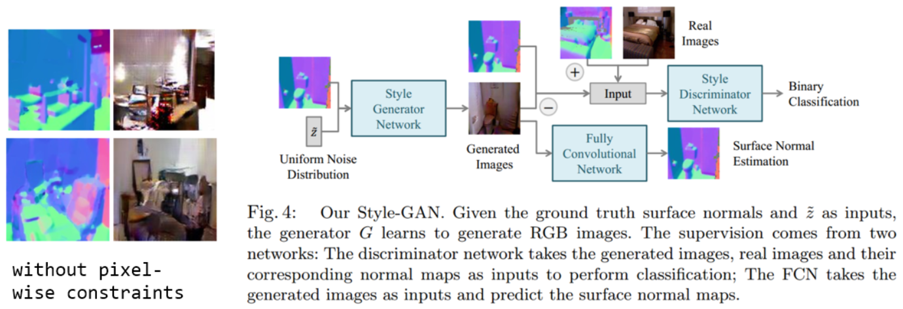

We train Fully Convolutional Network(FCN) wieh classification for surface normal estimation, using the RGBD data which provides indoor scene images and ground truth surface normals.

### Joint Learning for S2-GAN
After training the Structure-GAN and Style-GAN independently, we merge all networks and train them jointly with removing the FCN constraint.

### Experiments

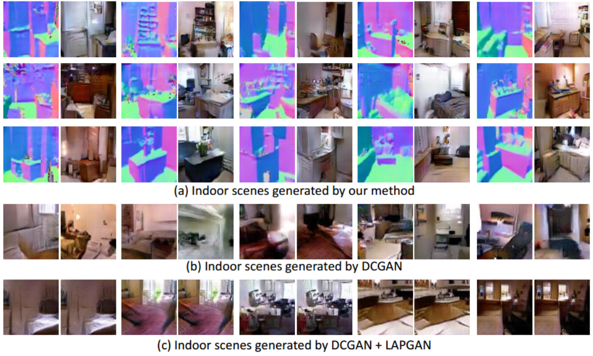

## Learning from Simulated and Unsupervised Images through Adversarial Training
### Main idea
1. To reduce the gap between synthetic and real image distributions, the authors propose Simulated+Unsupervised (S+U) learning, where the task is to learn a model to improve the realism of a simulator’s output using unlabeled real data, while preserving the annotation information from the simulator.

2. The authors make several key modifications to the standard GAN algorithm to preserve annotations, avoid artifacts, and stabilize training: (i) a ‘self-regularization’ term, (ii) a local adversarial loss, and (iii) updating the discriminator using a history of refined images. 

### Architecture
The key requirement for S+U learning is that the refined image x’ should look like a real image in appearance while preserving the annotation information from the simulator.

### Adversarial Loss with Self-Regularization
To add realism, we train our refiner network using an adversarial loss. The loss of discriminator network and refiner network are followed:

where D(.) is the probability of the input being a synthetic image, and 1 − D(.) is that of a real one. 

To preserve annotations information of the simulator, we propose using a slef regularization loss that minimizes per-pixel difference between a feature transform of the synthetic and refined images.

where ψ is the mapping from image space to a feature space, and |.|1 is the L1 norm. The feature transform can be an identity map, image derivatives, mean of color channels, or a learned transformation such as a convolutional neural network

The overall refiner loss function: 

### Local adversarial loss
Furthermore, to avoid drifting and introducing spurious artifacts while attempting to fool a single stronger discriminator, we limit the discriminator’s receptive field to local regions, resulting in multiple local adversarial losses per image.
- When we train a single strong discriminator network, the refiner network tends to over-emphasize certain image features to fool the current discriminator network, leading to drifting and producing artifacts.
- Any local patch sampled from the refined image should have similar statistics to a real image patch.
- This division not only limits the receptive field, and hence the capacity of the discriminator network, but also provides many samples per image for learning the discriminator network.

### perceptual loss
By minimizing the perceptual adversarial loss function LT with respect to parameters of T, we will encourage the network T to generate image T(x) that has similar high-level features with its ground-truth y. 

If the sum of discrepancy between the current learned representations of transformed image T(x) and ground-truth image y is less than the positive margin m, the loss function LD will upgrade the discriminative network D for new high-dimensional spaces, which discover the discrepancy that still exist between the transformed images and corresponding ground-truth. 

### Loss function
Given a pair of data (x, y) ∈ (X(input), Y(ground-truth)), the loss function of image transformation network J(T) and the loss function of discriminative network J(D) are formally defined as:

## Face Synthesis from Visual Attributes via Sketch using Conditional VAEs and GANs

### Main idea
the authors synthesize face images from attributes and
text descriptions in three stages: 
(1) Synthesis of facial sketch from attributes using a CVAE architecture, 
(2) Enhancement of coarse sketches to produce sharper sketches using a GANbased framework, and 
(3) Synthesis of face from sketch using another GAN-based network

### Motivation
Visual description-based face synthesis has many applications in law enforcement and entertainment.

### Architecture
Three-stage training network: 

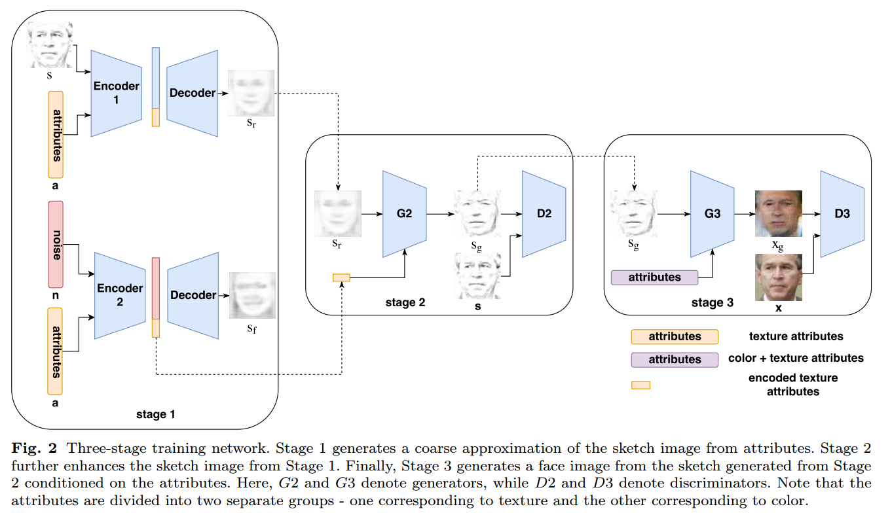

Testing phase:

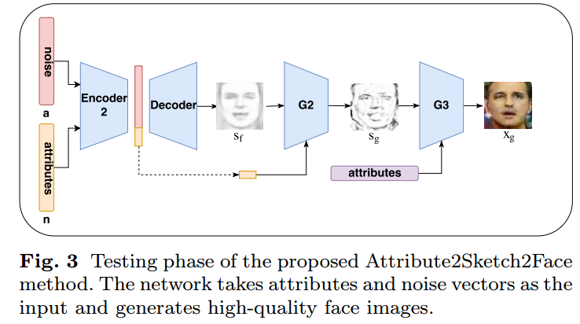

### Stage 1: Attribute-to-Sketch
In the A2S stage, the authors adapt the CVAE architecture. Given a texture attribute vector a, noise vector n, and ground-truth sketch s, we aim to learn a model Pθ(s|a z), which can model the distribution of s and generate s(r). The objective is to find the best parameter θ which maximizes the loglikelihood log Pθ(s|a).

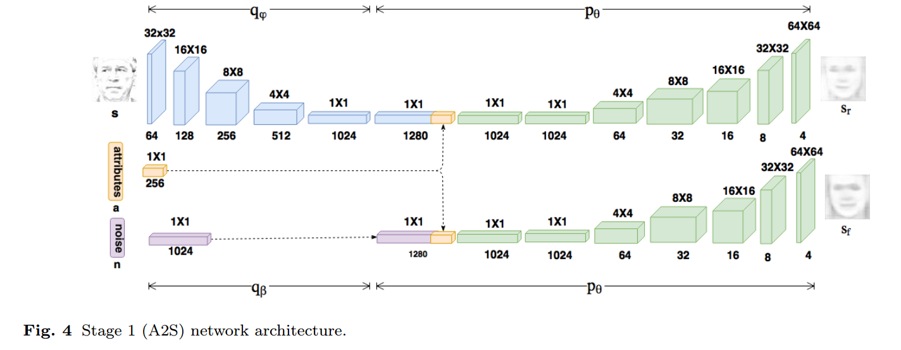

The encoder q(φ) takes sketch and attributes as input, whereas q(β) takes noise and attribute vectors as input. The overall loss function of the A2S stage is as follows: 

KL(Qφ(z|s a)||Pθ(z)) and KL(Qβ(z|n a)||Pθ(z)), are the regularization terms in order to enforce the latent variable z ~ Qφ(z|s a) and z ~ Qβ(z|n a) both match the prior normal distribution, Pθ(z).

### Stage 2: Sketch-to-Sketch (S2S)
S2S network consists of a generator sub-network G2 (based on UNet and DenseNet architectures) conditioned on the encoded attribute vector from the A2S stage and a patch-based discriminator subnetwork D2. 

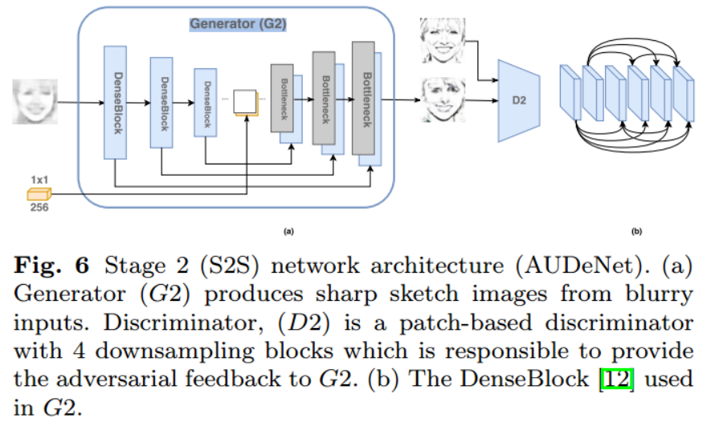

UNet incorporates longer skip connections to preserve low-level features, DenseNet employs short range connections within microblocks resulting in maximum information flow between layers in addition to an efficient network.

Additionally, patch-based discriminator ensures preserving of high-frequency details which are usually lost when only L1 loss is used. 

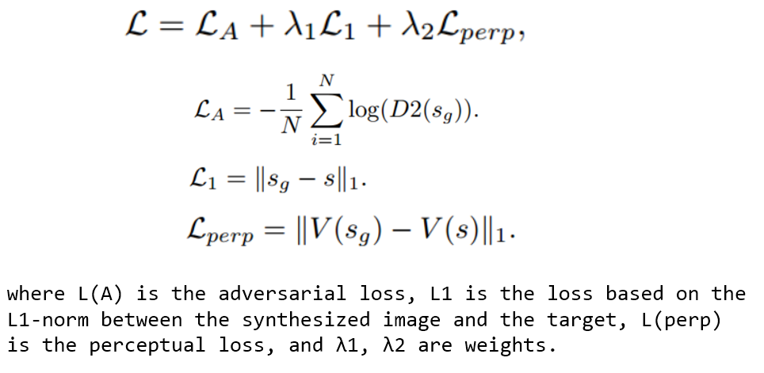

### Stage 3: Sketch-to-Face (S2F)
The visual attribute vector is combined with the latent representation to produce attribute-preserved image reconstructions.

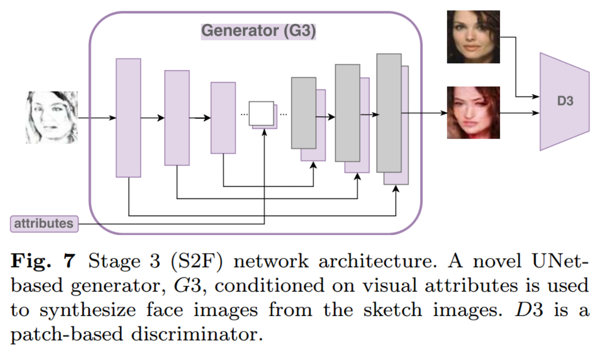

The network parameters for the S2F stage are learned by minimizing

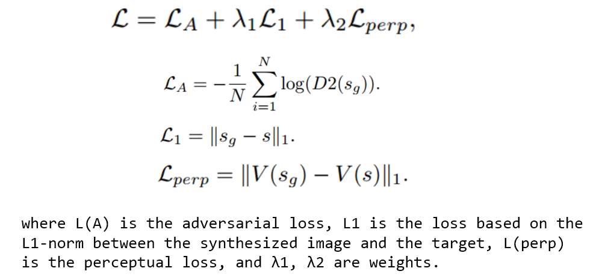

## Experiments
the authors show the image synthesis capability of our network by manipulating the input attribute and noise vectors. Note that, the testing phase of our network takes attribute vector and noise as inputs and produces face reconstruction as the output. 

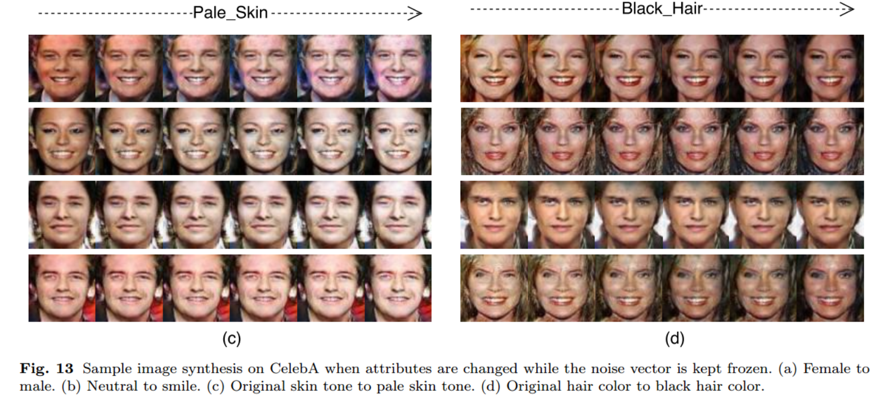

