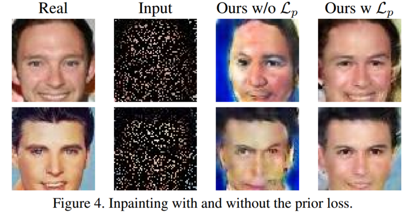
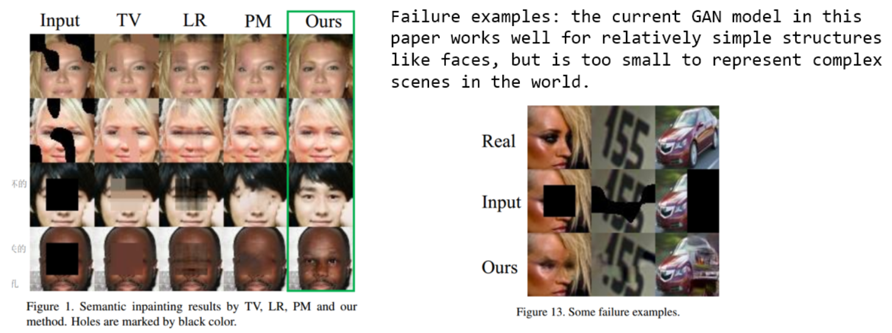
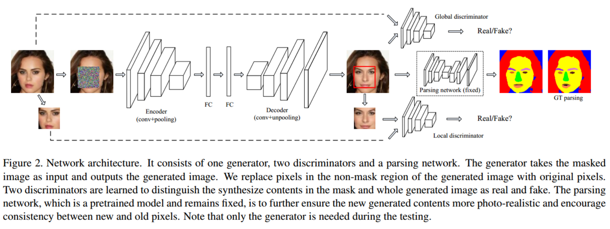
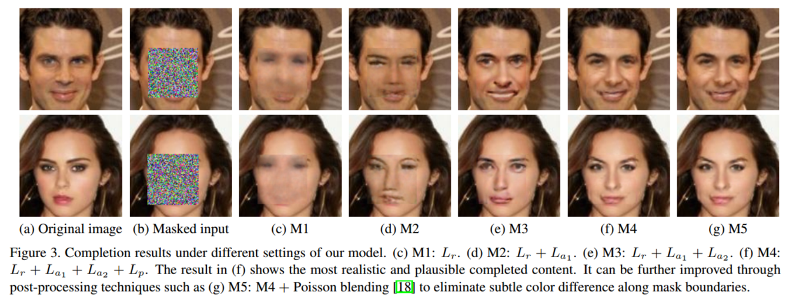
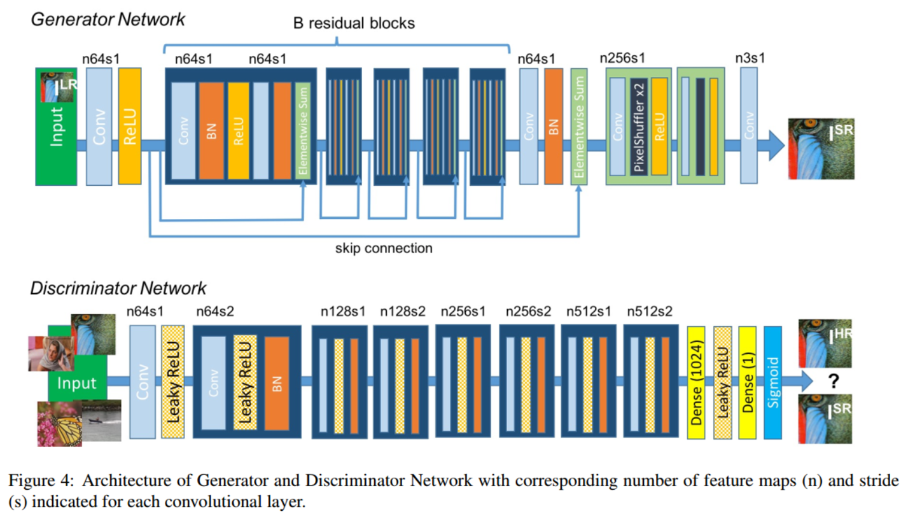
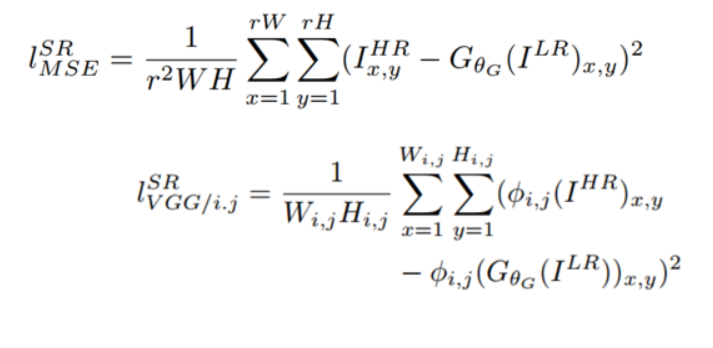
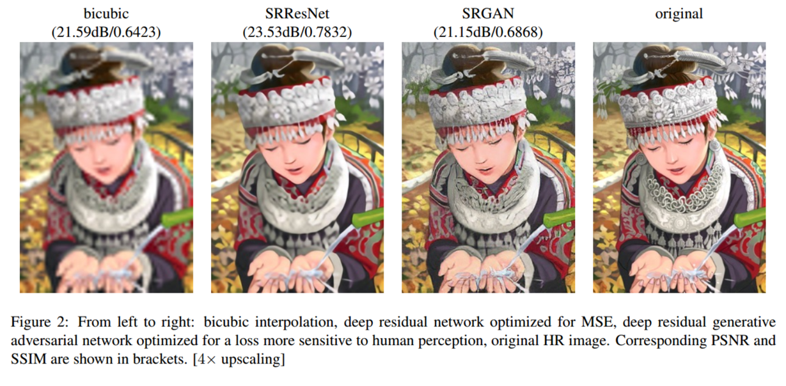
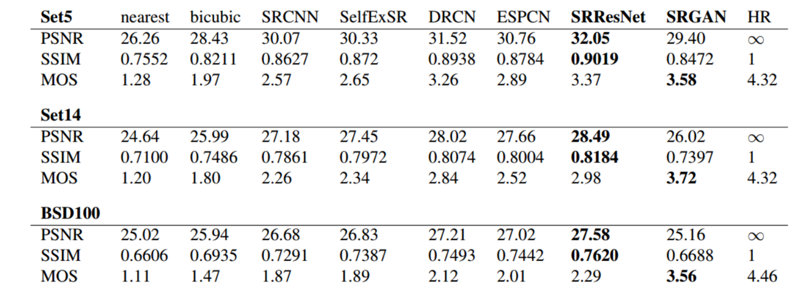
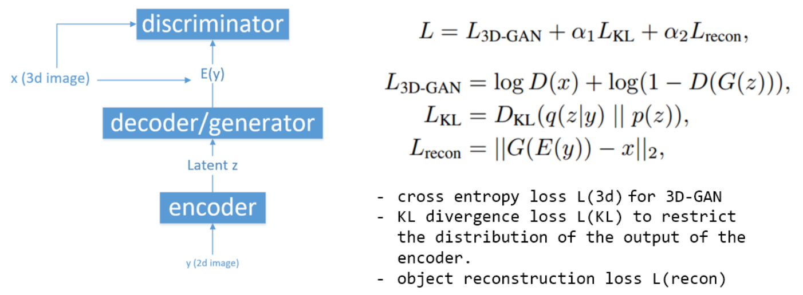
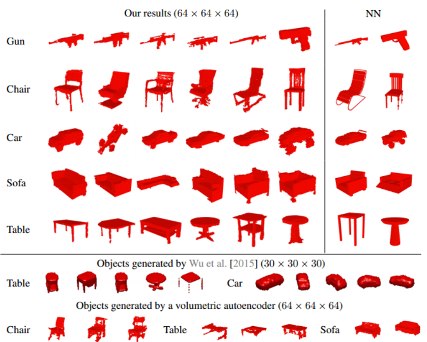

<!-- TOC -->

- [Image Inpainting](#image-inpainting)
    - [Semantic Image Inpainting with Deep Gnerative Models](#semantic-image-inpainting-with-deep-gnerative-models)
        - [Main idea](#main-idea)
        - [Architecture](#architecture)
        - [Experiments](#experiments)
    - [Generative Face Completion](#generative-face-completion)
        - [Main idea](#main-idea)
        - [Architecture](#architecture)
        - [Loss](#loss)
        - [Training](#training)
- [Super-Resolution](#super-resolution)
    - [Photo-Realistic Single Image Super-Resolution Using a Generative Adversarial Network](#photo-realistic-single-image-super-resolution-using-a-generative-adversarial-network)
        - [Main idea](#main-idea)
        - [Architecture](#architecture)
        - [Generator](#generator)
        - [MSE loss and VGG loss](#mse-loss-and-vgg-loss)
        - [Discriminator](#discriminator)
        - [Experiments](#experiments)
- [3D](#3d)
    - [Learning a Probabilistic Latent Space of Object Shapes via 3D Generative-Adversarial Modeling](#learning-a-probabilistic-latent-space-of-object-shapes-via-3d-generative-adversarial-modeling)
        - [Main idea](#main-idea)
        - [3D-GAN](#3d-gan)
        - [3D-VAE-GAN](#3d-vae-gan)
        - [Experiments](#experiments)

<!-- /TOC -->

# Image Inpainting

## Semantic Image Inpainting with Deep Gnerative Models

### Main idea
The authors propose a novel method for semantic image inpainting, which generates the missing content by conditioning on the available data.

Given a trained generative model, the authors search for the closest encoding of the corrupted image in the latent image manifold using the context and prior losses, and pass this encoding through the generative model to infer the missing content.

### Architecture

1 Finding the closest encoding z^

2 Importance Weighted Context Loss

3 Prior Loss penalizes unrealistic images

λ is a parameter to balance between the two losses. Without Lp, the mapping from y to z may converge to a perceptually implausible result.

4 Poisson blending is used to preserve the same intensities of the surrounding pixels. 

The key idea is to keep the gradients of G(z^) to preserve image details while shifting the color to match the color in the input image y.

### Experiments

## Generative Face Completion
### Main idea
The authors propose a algorithm to directly generate contents for missing regions based on a neural network, which consists of a reconstruiction loss, two adversarial losses and a semantic parsing loss.

### Architecture

### Loss
The generator G is designed as an autoencoder to construct new contents given input images with missing regions. And we replace pixels in the non-mask region of the generated image with original pixels.

- the hidden representations obtained from the encoder capture more variations and relationships between unknown and known regions, which are then fed into the decoder for generating contents.
- The generator can be trained to fill the masked region or missing pixels with small reconstruction errors.
- L2 loss penalizes outliers heavily, and the network is encouraged to smooth across various hypotheses to avoid large penalties, which make generated images blurry and smooth.

We adopt a local discriminator and a global discriminator to encourage more photo-realistic results.
- First, the local loss can neither regularize the global structure of a face, nor guarantee the statistical consistency within and outside the masked regions.
- Second, while the generated new pixels are conditioned on their surrounding contexts, a local D can hardly generate a direct impact outside the masked regions during the back propagation.

The parsing network, which is a pretrained model and remains fixed, is to further ensure the new generated contents more photo-realistic and encourage consistency between new and old pixels.

- the GAN model tends to generate independent facial components that are likely not suitable to the original subjects with respect to facial expressions and parts shapes
- the global D is not effective in ensuring the consistency of fine details in the generated image. 
- Both cases indicate that more regularization is needed to encourage the generated faces to have similar high-level distributions with the real faces

loss function

- A reconstruction loss Lr to the generator, which is the L2 distance between the network output and the original image. 
- The local discriminator only provides training signals (loss gradients) for the missing region while the global discriminator back-propagates loss gradients across the entire image
- The loss Lp is the simple pixelwise softmax loss

### Training
The training process is scheduled in three stages by gradually increasing the difficulty level and network scale.

First, we train the network using the reconstruction loss to obtain blurry contents.

Second, we fine-tune the network with the local adversarial loss. 

The global adversarial loss and semantic regularization are incorporated at the last stage.

# Super-Resolution
## Photo-Realistic Single Image Super-Resolution Using a Generative Adversarial Network
### Main idea
1. The authors present SRGAN, a generative adversarial network (GAN) for image superresolution (SR) with a perceptual loss function which consists of an adversarial loss and a content loss.

2. The adversarial loss pushes the solution to the natural image manifold, using a discriminator network that is trained to differentiate between the super-resolved images and original photo-realistic images.

3. In addition, the content loss measures perceptual similarity using high-level feature maps of the VGG network, instead of similarity in pixel space. 

### Architecture

### Generator
For training images I(HR), with corresponding I(LR):

I(LR) is obtained by applying a a Gaussian filter to I(HR), followed by a downsampling operation with downsampling factor r

### MSE loss and VGG loss

Minimizing MSE encourages finding pixel-wise averages of plausible solutions which are typically overly-smooth and thus have poor perceptual quality

MSE loss have high peak signal-to-noise ratios, but they are often lacking high-frequency details and are perceptually unsatisfying in the sense that they fail to match the fidelity expected at the higher resolution. 

### Discriminator

### Experiments

SRResNet sets a new state of the art on public benchmark datasets when evaluated with the widely used PSNR measure.

SRGAN reconstructs for large upscaling factors (4×) are, by a considerable margin, more photo-realistic than reconstructions obtained with state-ofthe-art reference methods, Using extensive MOS testing

# 3D
## Learning a Probabilistic Latent Space of Object Shapes via 3D Generative-Adversarial Modeling
### Main idea
The authors propose a novel framework, namely 3D Generative Adversarial Network (3D-GAN), which generates 3D objects from a probabilistic space by leveraging recent advances in volumetric convolutional networks and generative adversarial nets.  

### 3D-GAN

For each batch, the discriminator only gets updated if its accuracy in the last batch is not higher than 80% because the discriminator usually learns much faster than the generator.

### 3D-VAE-GAN

we map a 2D image to the latent representation and recover the 3D object corresponding to that 2D image.

### Experiments

