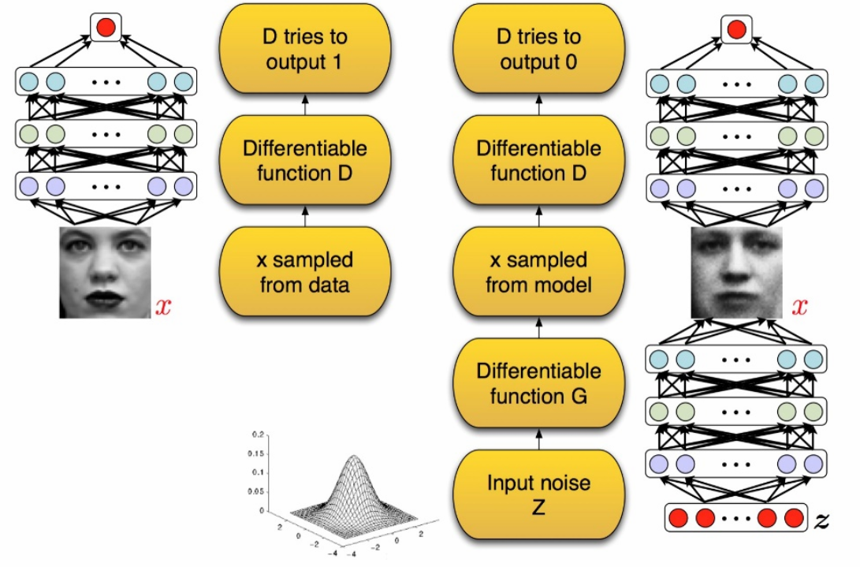
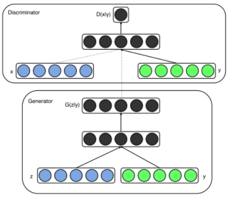
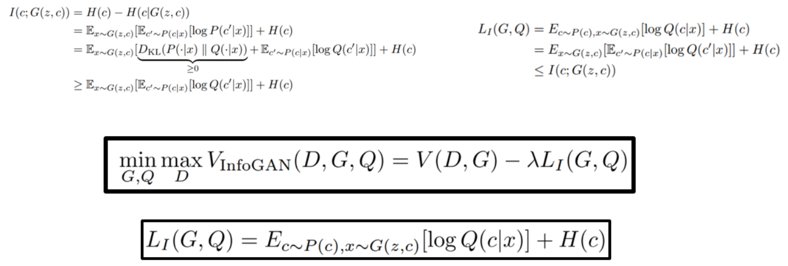
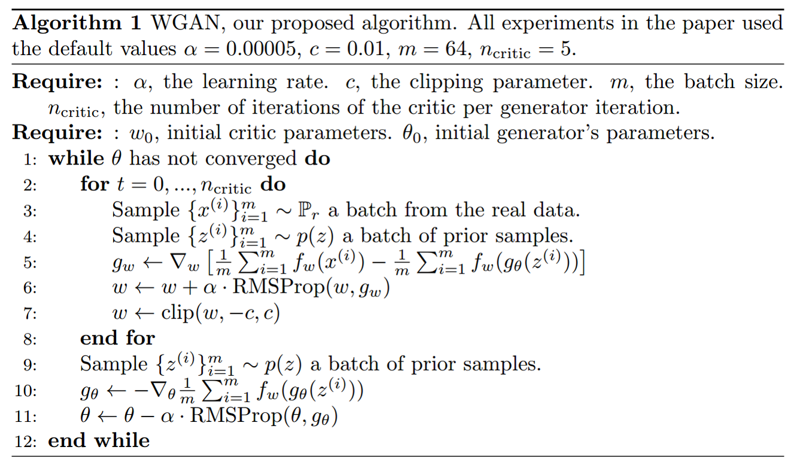
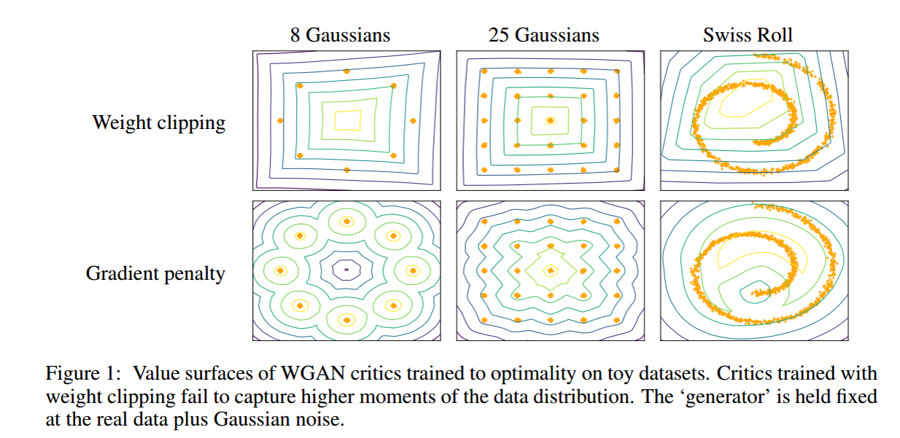
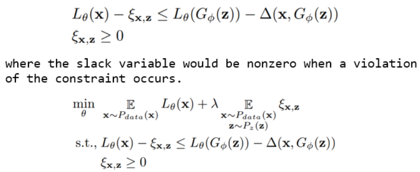
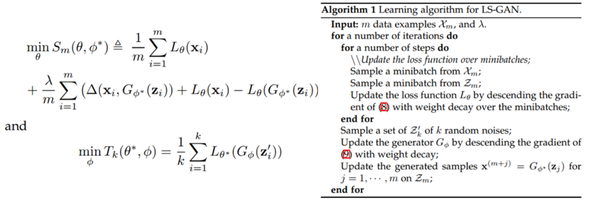

<!-- TOC -->

- [Theory](#theory)
    - [Generative Adversarial Nets](#generative-adversarial-nets)
        - [Main idea](#main-idea)
        - [Architecture](#architecture)
        - [Global Optimality](#global-optimality)
        - [Training](#training)
        - [Advantages and disadvantages](#advantages-and-disadvantages)
    - [f-GAN:Training Generative Neural Samplers using Variational Divergence Minimization](#f-gantraining-generative-neural-samplers-using-variational-divergence-minimization)
        - [Main idea](#main-idea)
        - [f-divergence](#f-divergence)
        - [Variational Estimation](#variational-estimation)
        - [Variational Divergence Minimization](#variational-divergence-minimization)
        - [Algorithms for VDM](#algorithms-for-vdm)
        - [Experiments](#experiments)
    - [Conditional Generative Adversarial Nets](#conditional-generative-adversarial-nets)
        - [Main idea](#main-idea)
        - [Motivation](#motivation)
        - [CGAN](#cgan)
        - [Experiments](#experiments)
    - [InfoGAN: Interpretable Representation Learning by Information Maximizing Generative Adversarial Nets](#infogan-interpretable-representation-learning-by-information-maximizing-generative-adversarial-nets)
        - [Main idea](#main-idea)
        - [Mutual Information](#mutual-information)
        - [Variational Mutual Information Maximization](#variational-mutual-information-maximization)
        - [Architecture](#architecture)
        - [Experiments](#experiments)
    - [ENERGY-BASED GENERATIVE ADVERSARIAL NETWORKS](#energy-based-generative-adversarial-networks)
        - [Main idea](#main-idea)
        - [EBGAN](#ebgan)
        - [EBGAN USING AUTO-ENCODERS](#ebgan-using-auto-encoders)
    - [BEGAN: Boundary Equilibrium Generative Adversarial Networks](#began-boundary-equilibrium-generative-adversarial-networks)
        - [Main idea](#main-idea)
        - [Auto-encoders loss](#auto-encoders-loss)
        - [Wasserstein distance lower bound](#wasserstein-distance-lower-bound)
        - [GAN objective](#gan-objective)
        - [Equilibrium](#equilibrium)
        - [Boundary Equilibrium GAN](#boundary-equilibrium-gan)
        - [Convergence measure](#convergence-measure)
    - [Wasserstein GAN](#wasserstein-gan)
        - [Main idea](#main-idea)
        - [analysis](#analysis)
        - [Wasserstein distance](#wasserstein-distance)
        - [Wasserstein GAN](#wasserstein-gan)
        - [Training](#training)
        - [Experiments](#experiments)
    - [Improved Training of Wasserstein GANs](#improved-training-of-wasserstein-gans)
        - [Main idea](#main-idea)
        - [Difficulties of WGAN](#difficulties-of-wgan)
        - [WGAN-GP](#wgan-gp)
    - [Loss-Sensitive Generative Adversarial Networks on Lipschitz Densities](#loss-sensitive-generative-adversarial-networks-on-lipschitz-densities)
        - [Main idea](#main-idea)
        - [Motivation](#motivation)
        - [Loss-Sensitive GAN](#loss-sensitive-gan)
        - [Algorithm](#algorithm)
    - [Are GANs Created Equal? A Large-Scale Study](#are-gans-created-equal-a-large-scale-study)
        - [Main idea](#main-idea)
        - [Motivation](#motivation)
        - [Flavors of GAN](#flavors-of-gan)
        - [Metrics](#metrics)
        - [Large-scale Experimental Evaluation](#large-scale-experimental-evaluation)

<!-- /TOC -->

# Theory
## Generative Adversarial Nets
### Main idea
1. The authors propose a net framework for estimating generative models via an adversarial process: a generative model G that captures the data distribution, and a discriminative model D that estimates the probability that a sample came from the training data rather than G.

2. G and D are defined by multilayer perceptrons, the entire system can be trained simultaneously with backpropagation. There is no need for any Markov chains or unrolled approximate inference networks during either training or generation of samples.

3. In the space of arbitrary functions G and D, a unique solution exists, with G recovering the training data distribution and D equal to ½ everywhere.

### Architecture

To learn the generator’s distribution P(g) over data x, we train D to maximize the probability of assigning the correct label to both training examples x and samples from G, and simultaneously train G to minimize log(1 − D(G(z))).

### Global Optimality
step 1: For G fixed, the optimal discriminator D is to maximize V(D,G), which can be interpreted as maximizing the log-likehood for estimating the conditional probability P(Y=y|x).

step 2: For D fixed, the optimal generator G is to minimize C(G). Since the Jensen–Shannon divergence between two distributions is always non-negative and zero, only when they are equal, we have shown that C∗ = −log(4) is the global minimum of C(G) and that the only solution is p(g) = p(data)

### Training

(1) Rather than training G to minimize log(1 − D(G(z))) we can train G to maximize log D(G(z))

(2) With sufficiently small updates of G, P(g) converges to P(x)

### Advantages and disadvantages

(1) Computational advantage: no Markov chains, backprop, no inference
 
(2) Statistical advantage: no copies, representing ability

(3) Disadvantages: non-convergence, collapse problem, uncontrollable

## f-GAN:Training Generative Neural Samplers using Variational Divergence Minimization

### Main idea
The authors show that the generative-adversarial approach is a special case of an existing more general variational divergence estimation approach, where any f-divergence can be used for training generative neural samplers.

### f-divergence
Statistical divergences measure the difference between two given probability distribution. Given two distribution P and Q that posses an absolutely continuous density function p and q, we define the f-divergence,

where the generator function f is convex, lower-semicontinuous function satisfying f(1)=0

### Variational Estimation
Every convex, lower-semicontinuous function f has a convex conjugate function f*, 

We can also represent f as,

Leverage the above variational representation of f in the definition of f-divergence to obtain a lower bound on the divergence,

the bound is tight for 

### Variational Divergence Minimization
We can use the variational lower bound on the f-divergence D_f(D|Q) in order to estimate a generative model Q given a true distribution P. 
- Q is our generative model
- T is our variational function
- We can learn a generative model Q(θ) by finding a saddle-point of the following f-GAN objective function, where we minimize with respect to θ and maximize with respect to w.

some example

### Algorithms for VDM
Numerical methods to find saddle points, alternating method:

single-step optimization procedure: Algorithm 1 geometrically converges to a saddle point (θ∗, w∗) if there is a neighborhood around the saddle point in which F is strongly convex in θ and strongly concave in w

### Experiments

## Conditional Generative Adversarial Nets
### Main idea
The authors introduce the conditional version of generative adversarial nets, which can be constructed by simply feeding the data like y, wishing to condition on to both the generator and discriminator.

### Motivation
(1) In an unconditional generative model, there is no control on modes of data being generated, which results in uncontrollable state for larger imgaes with more pixels.
(2) However, by conditioning the model on additional information it is possible to direct the data generation process. Such conditioning could be based on class labels, on some part of data for inpainting, or even data from different modality.

### CGAN
We perform the conditioning by feeding y into the both the discriminator and generator as additional input layer, where y could be any kind of auxiliary information, such as class labels or data from other modalities

Two-player min-max game:

Two-player min-max game with conditional probability:

### Experiments

## InfoGAN: Interpretable Representation Learning by Information Maximizing Generative Adversarial Nets

### Main idea
The authors describes InfoGAN, an information-theoretic extension to the Generative Adversarial Network that is able to learn disentangled representations by maximizing the mutual information between a small subset of the latent variables c and the observation G(z,c).

### Mutual Information
(1) Decompose the input noise vector into two parts:(i)z, which is treated as source of incompressible noise;(ii)c, which we will call the latent code and target the salient structured semantic features of the data distribution.

(2) To make latent code c correspond to semantic features, the authors propose an information-theoretic regularization: there should be high mutual information between latent code c and generator distribution G(z,c).

### Variational Mutual Information Maximization
The posterior P(c|x) of I(c;G(z,c)) is unaccessible, we can obtain a lower bound of it by defining an auxiliary distribution Q(c|x) to approximate P(c|x)

### Architecture
The author parametrize the auxiliary distribution Q as a neural network, which shares all convolutional layers with D. There is one final fully connected layer to output parameters for the conditional distribution Q(c|x), just like a classfier.

### Experiments

## ENERGY-BASED GENERATIVE ADVERSARIAL NETWORKS
### Main idea
1. The authors introduce the “Energy-based Generative Adversarial Network” model(EBGAN) which views the discriminator as an energy function that attributes low energies to the regions near the data manifold and higher energies to other regions.
2. Viewing the discriminator as an energy function allows to use a wide variety of architectures and loss functions in addition to the usual binary classifier with logistic output.
3. The authors show one instantiation of EBGAN framework as using an auto-encoder architecture, with the energy being the reconstruction error, which exhibits more stable behavior than regular GANs during training.

### EBGAN
Given a positive margin m, a data sample x and a generated sample G(z), the discriminator loss L_D and the generator loss L_G are formally defined by:

the discriminator D to minimize the quantity V and the generator G to minimize the quantity U

(1) If (D∗; G∗) is a Nash equilibrium of the system, then p(G∗) = p(data) almost everywhere, and V (D∗; G∗) = m.

(2) A Nash equilibrium of this system exists and is characterized by (a) p(G∗) = p(data) (almost everywhere) and (b) there exists a constant γ in [0,m] such that D∗(x) = γ (almost everywhere)

### EBGAN USING AUTO-ENCODERS
In authors’ experiments, the discriminator D is structured as an auto-encoder:

1. The reconstruction-based output offers a diverse targets for the discriminator likely produce very different gradient directions within the minibatch
2. Auto-encoders have traditionally been used to represent energy-based model and arise naturally, which contributes to discovering the data manifold by itself.
3. To avoid identity mapping, implement the repelling regularizer involves a PT that runs at a representation level.

## BEGAN: Boundary Equilibrium Generative Adversarial Networks

### Main idea
(1) The authors propose a new equilibrium enforcing method paired with a loss derived from the Wasserstein distance for training auto-encoder based Generative Adversarial Networks. 

(2) BEGAN provides a new approximate convergence measure and a way of controlling the trade-off between image diversity and visual quality.

### Auto-encoders loss
While typical GANs try to match data distributions directly, the authors aims to match auto-encoder loss distributions using a loss derived from the Wasserstein distance.

### Wasserstein distance lower bound
Let µ1,µ2 be two distributions of auto-encoder losses, and let m1,m2 be their respective means. The Wasserstein distance can be expressed as:

design the discriminator to maximize |m1-m2|: 

The authors select solution (b) for the objective since minimizing m1 leads naturally to auto-encoding the real images.

### GAN objective
Given the discriminator and generator parameters θ(D) and θ(G), each updated by minimizing the losses L(D) and L(G), we express the problem as the GAN objective, where z(D) and z(G) are samples from z:

### Equilibrium
1. In practice it is crucial to maintain a balance between the generator and discriminator losses.

2. If we generate samples that cannot be distinguished by the discriminator from real ones, the distribution of their errors should be the same, including their expected error. 

3. We can relax the equilibrium with the introduction of a new hyper-parameter γ~[0,1] defined as:

4. The γ term lets us balance discriminating real from generated images and auto-encoding real images. Lower values of γ lead to lower image diversity and γ is refered as the diversity ratio.

5. Lower values of γ lead to lower image diversity because the discriminator focuses more heavily on auto-encoding real images.

### Boundary Equilibrium GAN
Using Proportional Control Theory to maintain the equilibrium, the BEGAN objective is: 

This is implemented using a variable k~[0,1] to control how much emphasis is put on L(G(z)) during gradient descent.

###  Convergence measure

The authors derive a global measure of convergence by using the equilibrium concept: we can frame the convergence process as finding the closest reconstruction L(x) with the lowest absolute value of the instantaneous process error for the proportion control algorithm |γL(x)−L(G(z))|.

## Wasserstein GAN
### Main idea
(1) The author propose Wasserstein-GAN that minimizes a reasonable and efficient approximation of the EM distance, and theoretically show that the corresponding optimization problem is sound.

(2) In particular, training WGANs gets rid of maintaining a careful balabce in training of the discriminator and the generator, designing network architecture carefully and mode dropping phenomenon. 

(3) One of the most compelling practical benefits of WGANs is the ability to continuously estimate of the EM distance by training the discriminator to optimality. Plotting these learning curves is not only useful for debugging and hyperparameter searches, but also correlate remarkly well with the observed sample quality.

### analysis
(1) For original GAN, the no.1 loss function of Generator encounters gradient vanishing problem.
Generator loss function no.1

Optimal discriminator

Optimal generator is to minimum

When the dircriminator is good enough that two distributions are likely have no intersection or non-negligible intersection, causing that JS divergence is fixed as a constant log2 and does not provide a usable gradient. On the other hand, KL,JS and TV distances are not sensible cost function when learning distributions supported by low dimensional manifolds.

(2) For original GAN, the no.2 loss function of Generator, which minimizes an unbalanced optimization objective, encounters such problems as unstable gradient and mode collapse.
Generator loss function no.2

Optimal discriminator

Optimal generator is to minimum

First, the generator minimizes the KL divergence of Pg and Pr, meanwhile maximizes the JS divergence of them, which leads to gradient instability numerically. Second, the KL divergence is asymmetrical, with severe punishment in not generating real samples and light punishment in generating unreal samples, which results in that the generator tends to generate reduplicate but safe samples ignoring diversity.

### Wasserstein distance
The Earth-Mover(EM) distance or Wasserstein-1 always reflecting distances 

Comparison:

### Wasserstein GAN
W(Pr, Pθ) have nicer properties than JS,KL…, to avoid intractable joint distributions, we choose a transformation using Lipschitz continuation:

Lipschitz condition limits the maximum local variation of a continuous function, which means that K*W is the supremum over all the K-Lipschitz functions with constant ||f||_L not exceeding K. Particularly, we define a NN parameterized with w to represent K-Lipschitz functions:

We clamp the weights to a fixed box after each gradient update to satisfy K-Lipschitz condition.

Discriminator:

The discriminator maximizes above formula to approximatively get Wasserstein distance between Pr and Pg 

Generator:

The generator approximatively minimizes the Wasserstein distance with more reliable gradient.

### Training

1. Throw out the sigmoid function in the last layer of the generator, because approximating Wasserstein distance is the regression task instead of classification task.

2. The loss of generator and discriminator does not take log

3. Clamp the weights to a fixed box after each gradient update 

4. Recommend RMSProp or SGD as optimization algorithms, as the loss is nonstationary for high learning rate.

### Experiments

## Improved Training of Wasserstein GANs
### Main idea
(1) The authors find that WGANs still generate low-quality samples or fail to convergence due to the use of weight clipping in WGAN to enforce a Lipschitz constraint on the critic, which can lead to pathological behavior.

(2) The authors propose an alternative method for enforcing the Lipschitz constraint: instead of clipping weights, penalize the norm of the gradient of the critic with respect to its input.

### Difficulties of WGAN
1. Capacity underuse: under a weight-clipping constraint, most neural network architectures can only attain their maximum gradient norm of k, making the critic learns extremely simple functions

2. Exploding and vanishing gradients: depend on the value of the clipping threshold c. 

### WGAN-GP
Exactly enforcing the constraint is not easily tractable, so instead we enforce a soft version: at certain points sampled from a distribution over the input space x’~ P(x’), we evaluate the gradient of the critic ∇x’D(x’) and penalize its squared distance from 1 in the critic loss function.

algorithm

experimrnts

## Loss-Sensitive Generative Adversarial Networks on Lipschitz Densities
### Main idea
(1) The authors propose a novel Loss-Sensitive GAN(LS-GAN) that learns a loss function to distinguish real and generated samples by the assumption that a real example should have a smaller loss than a generated sample.

(2) The authors present a regularity condition on the underlying data density, which allows us to use a class of Lipschitz losses and generators to model the LS-GAN.

(3) The authors derive a non-parametric solution that characterizes the upper and lower bounds of the losses learned by the LS-GAN, both of which are piecewise linear and have non-vanishing gradient almost everywhere.

### Motivation
1. A dyadic treatment of real and generated data as positive and negative examples may oversimplify the problem of learning a GAN model.

2. Assuming the GAN has infinite modeling causes vanishing gradient and severe overfitting problem.

3. A large family of real-world distributions, where the data density does not change abruptly over points that are close to one another, satisfy Lipschitz densities.

### Loss-Sensitive GAN
1. The loss of a real sample should be smaller than that of a generated counterpart by an unfixed margin that depends on how close they are to each other in metric space.

2. Relax the above hard constraint by introducing a slack variable

- The first term minimizes the expected loss function over data distribution since a smaller value of loss function is preferred on real samples. 
- The second term is the expected error caused by the violation of the constraint.

3. minimize game

4. As λ->+∞, the density distribution P(G∗) of the samples generated by G(φ∗) will converge to the underlying data density P(data)

### Algorithm

Non-parametric solutions to the optimal loss function by minimizing (8) over the whole class of Lipschitz loss functions. 

## Are GANs Created Equal? A Large-Scale Study
### Main idea
(1) The authors provide a fair and comprehensive comparison of the state-of-the-art GANs, and empirically demonstrate that nearly all of them can reach similar values of FID, given a high enough computational budget.

(2) The authors adopt such metrics as inception score(IS), frechet inception distance(FID), precision and recall, and also verify the robustness of these models in a large-scale empirical evaluation

### Motivation
There is no clear consensus on which GAN algorithm(s) perform objectively better than the others, partially due to the lack of robust and consistent metric, as well as limited comparisons which put all algorithms on equal footage, including the computational budget to search over all hyperparameters.

The main issue with evaluation stems is untraceably computing the probability Pg(x). As a remedy, two evaluation metrics were proposed to quantitatively assess the performance of GANs: Inception Score(IS) and Frechet Inception Distance(FID)

### Flavors of GAN

### Metrics
(1) FID has some properties, such as robustness to noise, dectecting mode dropping and sensitive to encoding network.

(2) FID and IS are incapable of detecting overfitting: a memory GAN which simply stores all training samples would score perfectly under both measures.

(3) We propose an approximation to precision and recall for GANs and it can be used to quantify the degree of overfitting, which should be viewed as complementary to IS or FID.

(4) Computing the distance to the manifold: The problem of evaluating the quality of the generative model can be effectively transformed into a problem of computing the distance to the manifold.

### Large-scale Experimental Evaluation

We observe that, given a relatively low budget (say less than 15 hyperparameter settings), all models achieve a similar minimum FID. Furthermore, for a fixed FID, “bad” models can outperform “good” models given enough computational budget.

We argue that the computational budget to search over hyperparameters is an important aspect of the comparison between algorithms.

 We observe that GAN training is extremely sensitive to hyperparameter settings and there is no model which is significantly more stable than others.

