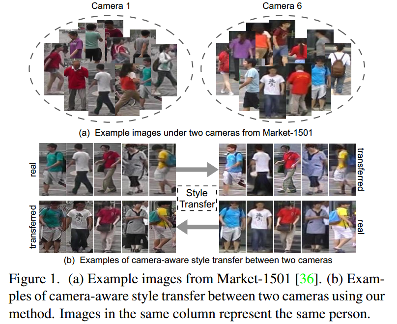
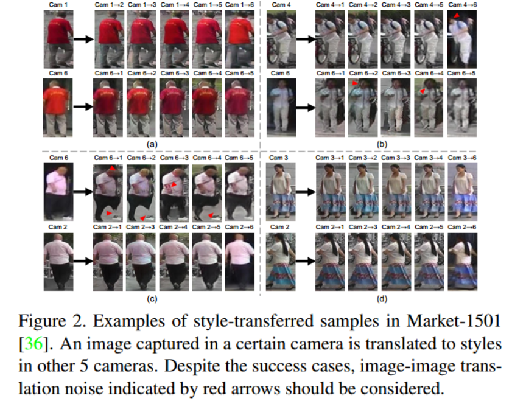
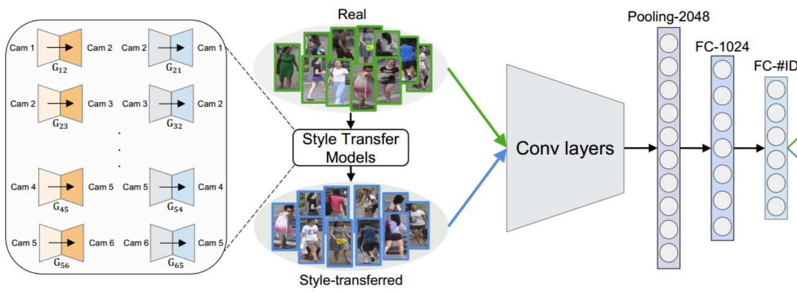

# Re-identification

## Camera Style Adaptation for Person Re-identification
### Main idea
Being a cross-camera retrieval task, person reidentification suffers from image style variations caused by different cameras. In this paper, we explicitly consider this challenge by introducing camera style (CamStyle) adaptation, where CamStyle can serve as a data augmentation approach that smooths the camera style disparities.

Specifically, with CycleGAN, labeled training images can be style-transferred to each camera, and, along with the original training samples, form the augmented training set. 

While increasing data diversity against over-fitting, also incurs a considerable level of noise. In the effort to alleviate the impact of noise, the label smooth regularization (LSR) is adopted. The vanilla version of our method (without LSR) performs reasonably well on few-camera systems in which over-fitting often occurs. 

### Motivation
To learn rich features robust to camera variations, annotating large-scale datasets is useful but prohibitively expensive. 

Nevertheless, if we can add more samples to the training set that are aware of the style differences between cameras, we are able to 1) address the data scarcity problem in person re-ID and 2) learn invariant features across different cameras. 

Preferably, this process should not cost any more human labeling, so that the budget is kept low.

### CycleGAN Review
Given two datasets {xi} and {yj}, collected from two different domains A and B, where xi ~ A and yj ~ B, The goal of CycleGAN is to learn two mapping function: G: A->B and F: B->A. 

The overall CycleGAN loss function is expressed as:

### Camera-aware Image-Image Translation
In this work, the authors employ CycleGAN to generate new training samples: the styles between different cameras are considered as different domains. 

To encourage the styletransfer to preserve the color consistency between the input and output, the authors add the identity mapping loss in the CycleGAN loss function.

With the learned CycleGAN models, for a training image collected from a certain camera, we generate L − 1 new training samples whose styles are similar to the corresponding cameras

Then we leverage the style-transferred images as well as their associated labels to train re-ID CNN in together with the original training samples. 

### Baseline Deep Re-ID Model
Given that both the real and fake (style-transferred) images have ID labels, the authors use the ID-discriminative embedding (IDE) to train the re-ID CNN model. Using the Softmax loss, IDE regards re-ID training as an image classification task.

The authors discard the last 1000-dimensional classification layer and add two fully connected layers. The first FC layer has 1024 dimensions named as "FC-1024", the second FC layer, is C-dimensional, where C is the number of classes in the training set.

### Training with CamStyle
In the vanilla version, each sample in the new training set belongs to a single identity. During training, in each mini-batch, we randomly select M real images and N fake images. The loss function can be written as:

In the full version, when considering the noise introduced by the fake samples, we introduce the full version which includes the label smooth regularization (LSR)

That is, we assign less confidence on the ground-truth label and assign small weights to the other classes. 

For real images, we do not use LSR because their labels correctly match the image content.

### Discussions
the working mechanism of the proposed data augmentation method mainly consists in: 
1) the similar data distribution between the real and fake (style-transferred) images, and 
2) the ID labels of the fake images are preserved. 

In the first aspect, the fake images fill up the gaps between real data points and marginally expand the class borders in the feature space.

The second aspect, on the other hand, supports the usage of supervised learning, a different mechanism from which leverages unlabeled GAN images for regularization.

### Experiments
Evaluation with different ratio of real data and fake data (M:N) 

Variant Evaluation

